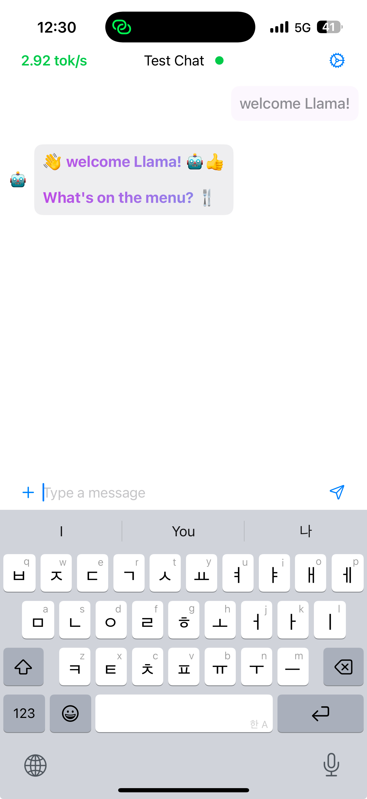

# 🦙Local Llama with iPhone📱 
----
## 📚목차

1. [📝개요](#1.-📝개요)
2. [📋문제정의](#📋문제정의)
3. [📋문제 해결을 위한 기술 스택](#📋문제-해결을-위한-기술-스택)
4. [📋모델 처리](#📋모델-처리)
5. [📋앱 디자인](#📋앱-디자인)
5. [📋앱 개발](#📋앱-개발)
6. [📋앱 개발 결과](#📋앱-개발-결과)


---
## 1. 📝개요
> OpenAI의 **ChatGPT**가 일상에 자리 잡으면서 개인정보 유출 문제가 부각되고 있다. 
사용자 데이터가 서버로 전송되어 학습 데이터로 활용될 가능성이 이 문제의 핵심이다. 
이를 해결하기 위해 **On-Device AI** 기술을 기반으로 한 **Local-Llama with iPhone** 솔루션을 제안한다.
---
## 📋문제정의
> 최근 OpenAI의 ChatGPT와 같은 대형 언어 모델(LLM)이 일상생활의 일부로 자리 잡으면서 개인정보 유출 문제가 점차 부각되며, 이러한 문제는 사용자의 대화 기록이 OpenAI 서버로 전송되고, 잠재적으로 학습 데이터로 활용될 가능성에서 기인한다. 

> 이는 민감한 데이터의 외부 유출과 프라이버시 침해 우려를 야기하며, 사용자 신뢰를 약화시키는 요인으로 작용하고 있다.
---
## 📋문제 해결을 위한 기술 스택
| ```Python``` | ```pytorch``` | ```CoreML``` | ```Swift``` | ```Figma``` | 
|--------|---------|--------|-------|-------|
|||||
| 딥러닝, 데이터 전처리 등에 사용되는 언어 | 딥러닝 모델을 다루기 위한 프레임워크 | On-Device 모델 변환 프레임 워크 | iOS 환경에서의 사용자 인터페이스(UI) 구현 | 프론트엔드 디자인을 위한 프로그램 | 

---
## 📋모델 처리
- ```meta llama```모델을 활용
- 기존 모델 구조 → On-Device 모델로 변환 불가
	- 변환을 위해 모델 구조 일부 수정 필요

> - 모델 수정을 통한 On-Device 모델로 변환 완료

---
## 📋앱 디자인
- 언어, 나이, 인종 상관없이 ```누구나 앱의 기능 이해``` 가능하도록 설계 진행

---
## 📋앱 개발
- ### 사용한 SDK 및 IDE
    - Xcode : Apple의 개발 툴, apple plaform에서 동작되는 어플리케이션 개발용도
    - Figma : 디자인 시스템 관리 기능 및 무료 소프트웨어로 쉽게 디자인 가능한 서비스

- ### UI 개발 과정
    1.  figma를 통한 기본 디자인을 작성
    2.  swiftUI를 통해서 앱의 디자인을 구현    
    
        

- ### 추론 로직 개발 과정
    > - LM에는 Tokenizer가 존재, 기존 swift로 구현된 tokenizer가 없음
    > - 이에 BPE Tokenizer를 Swift로 구현

    

    1. tokenizer를 통한 encoding 로직 구현
    2. model의 next sentence prediction 로직 구현
    3. ```topK sampler```를 사용해 추론 성능 향샹
    4. UI와 연결하여 앱 완성


---

## 📋앱 개발 결과

### AI 모델 성능
- 디바이스의 성능별로 모델의 성능이 다름
- 이유로 Apple 의 IOS의 영향이 큰것으로 확인, 추가적인 조사를 통해 개선이 필요

### 구축한 AI 모델을 통해 해결가능한 문제
- On-Device의 구동은 성공적, vectorDB등 여러 기술을 결합하여 
다양한 상황에서 구동될 수 있는것을 확인

### AI 모델 제한점 및 문제점, 추후 해결 방안
- 여전히 추론 성능이 문제
- Llama3.2 3b 모델로 실험한 결과 Iphone 16 pro 기준 `2 ~ 12 token/s` 속도로 너무 낮은 속도 측정
- 다양한 방면에서 모델의 추론속도를 높일 수 추가적인 연구 필요

---
